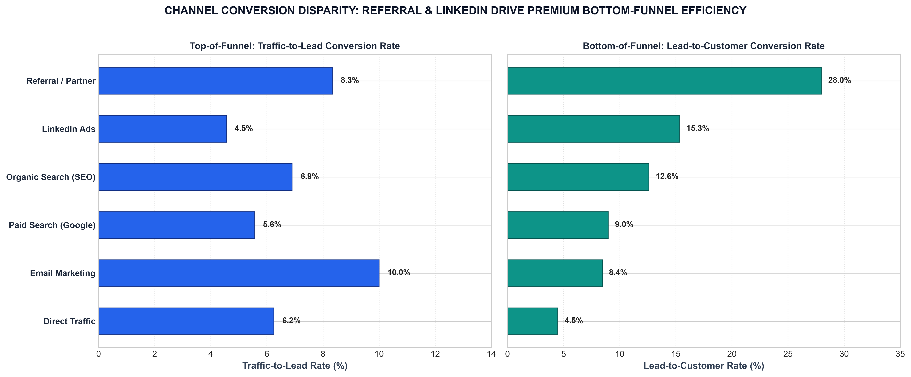
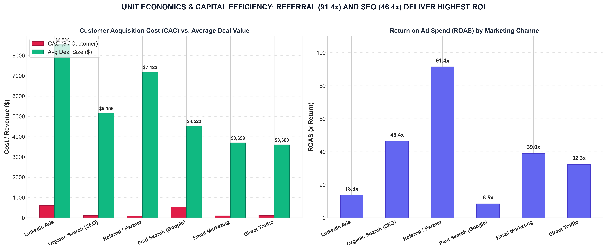
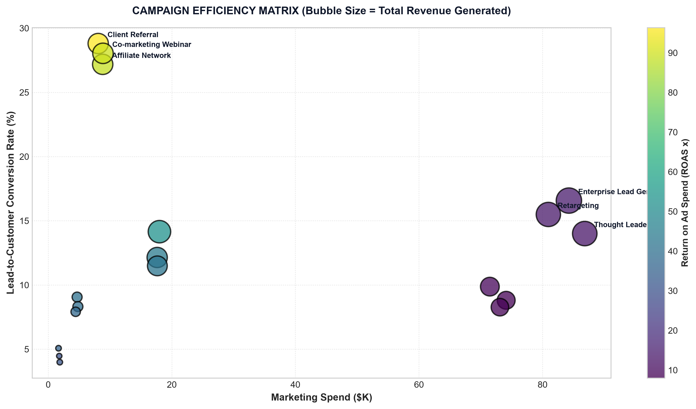
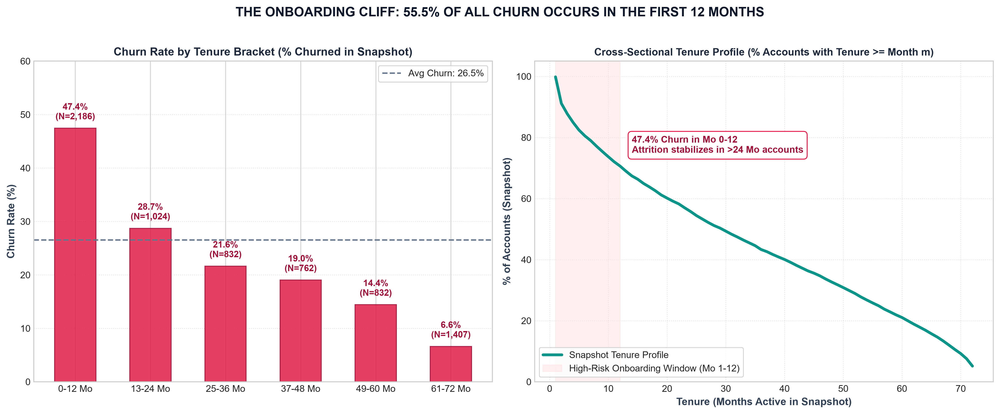
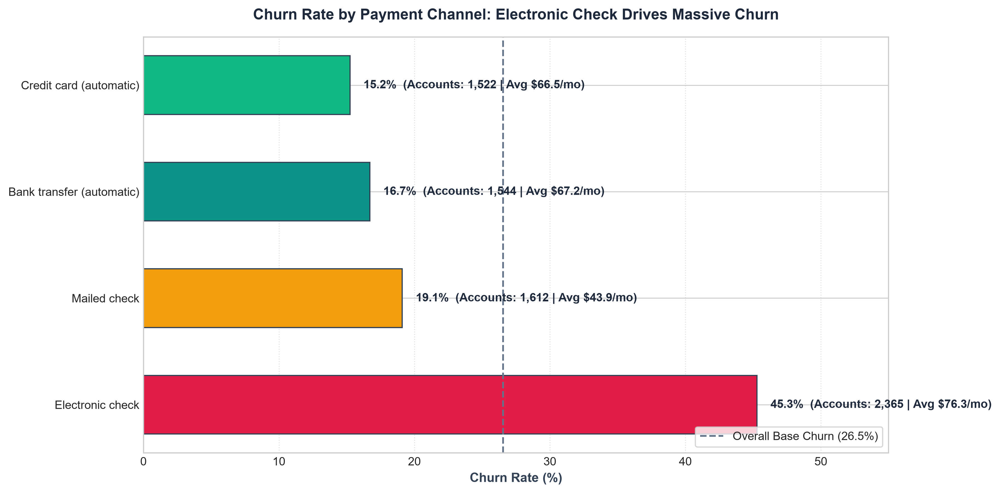
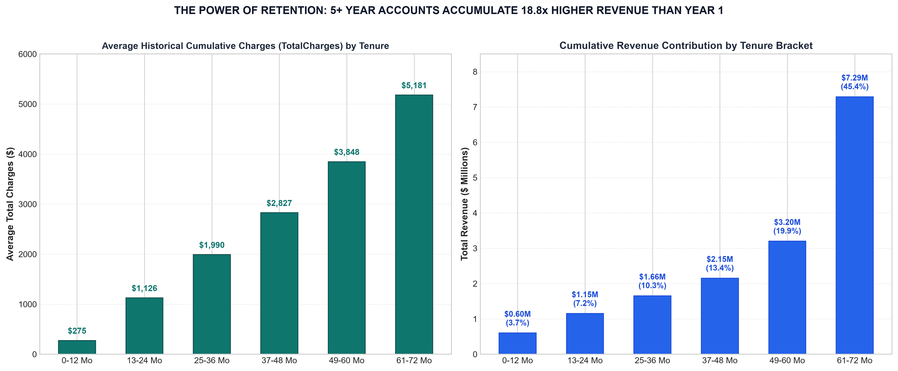
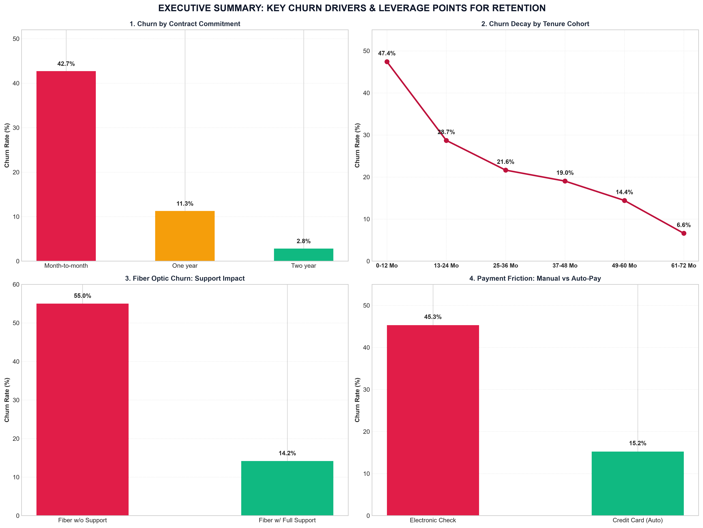

# 💼 Future Interns - Data Science & Analytics Portfolio

[](Marketing_Funnel_Dashboard.xlsx)
[](FUTURE_DS_01.pbix)
[](marketing_funnel_and_conversion_analysis.ipynb)
[](marketing_funnel_and_conversion_analysis.ipynb)
[]()
[]()

> **Future Interns Data Science & Analytics Program (2026)**  
> Production-grade data analytics, executive dashboard engineering, conversion rate optimization, and strategic business intelligence portfolio.

---

## 📌 Portfolio Project Quick Navigation

| Project | Domain | Core Tools | Primary Deliverable | Status |
|---|---|---|---|---|
| **[Task 3: Marketing Funnel & Conversion Performance](#-task-3-marketing-funnel--conversion-performance-analysis)** | Growth & Marketing Analytics | Excel, Python, Pandas, Matplotlib | [Excel Dashboard](Marketing_Funnel_Dashboard.xlsx) \| [Report](funnel_analysis_report.md) \| [Notebook](marketing_funnel_and_conversion_analysis.ipynb) | ✅ **Complete** |
| **[Task 2: Customer Retention & Churn Analysis](#-task-2-customer-retention--churn-analysis)** | Subscription & SaaS Analytics | Excel, Python, Pandas, Matplotlib | [Excel Dashboard](Customer_Retention_Dashboard.xlsx) \| [Report](retention_analysis_report.md) \| [Notebook](customer_retention_and_churn_analysis.ipynb) | ✅ **Complete** |
| **[Task 1: Retail Sales Analysis & Executive Dashboard](#-task-1-retail-sales-data-analysis--executive-dashboard)** | E-Commerce & Retail BI | Excel, Power BI, Python, RFM | [Excel Dashboard](Retail_Sales_Dashboard.xlsx) \| [PBIX Model](FUTURE_DS_01.pbix) \| [Report](analysis_report.md) | ✅ **Complete** |

---

# 🚀 Task 3: Marketing Funnel & Conversion Performance Analysis

> **Executive Business Objective:**  
> In digital marketing, SaaS, and high-growth startups, driving top-of-funnel traffic is meaningless if leads fail to convert into paying customers. This task evaluates **244,178 inbound website sessions**, **15,000 captured leads**, and **1,819 closed won customers** ($10.87M in pipeline revenue) to diagnose conversion bottlenecks, evaluate multi-channel unit economics (CAC / ROAS), and formulate high-ROI growth interventions.

> **📌 Data Provenance & Synthetic Data Disclosure:** As permitted by Future Interns project guidelines, Task 3 evaluates a synthetically modeled B2B multi-channel acquisition dataset engineered to mirror realistic enterprise SaaS conversion dynamics, stage drop-offs, sales cycle velocities, and unit economics. All metrics and sensitivity scenarios are computed directly from these structured data tables.

### 📑 Task 3 Core Deliverables
- **[Marketing_Funnel_Dashboard.xlsx](Marketing_Funnel_Dashboard.xlsx)**: 4-tab client-ready Excel dashboard featuring symmetrical KPI cards, native Excel charts, full funnel stage progression tables, campaign ROI breakdowns, and 5,000 lead records with autofilters.
- **[funnel_analysis_report.md](funnel_analysis_report.md)**: Comprehensive executive advisory report detailing stage drop-offs, channel attribution, unit economics (CAC / ROAS), and a 30-60-90 day optimization roadmap.
- **[marketing_funnel_and_conversion_analysis.ipynb](marketing_funnel_and_conversion_analysis.ipynb)**: Reproducible Python notebook natively executed via `nbconvert` with verified execution counts, outputs, and embedded plots.
- **[TASK3_README.md](TASK3_README.md)**: Dedicated stand-alone documentation for Task 3.
- **[task3_linkedin_post.txt](task3_linkedin_post.txt)**: Pre-formatted professional LinkedIn showcase post.
- **[visualizations/funnel/](visualizations/funnel/)**: 7 high-resolution (300 DPI) publication-ready charts.

### 🎯 Task 3 Executive KPI Scorecard
- **Total Inbound Traffic:** **244,178 Visitors** (100% baseline traffic)
- **Captured Leads:** **15,000 Leads** (**6.14% Traffic-to-Lead conversion rate**)
- **Marketing Qualified Leads (MQL):** **10,533 MQLs** (70.22% Lead-to-MQL rate)
- **Sales Qualified Leads (SQL):** **5,388 SQLs** (**51.15% MQL-to-SQL rate** - *The Mid-Funnel Leak*)
- **Closed Won Customers:** **1,819 Customers** (**12.13% Lead-to-Customer conversion**; 0.74% overall visitor-to-customer)
- **Total Marketing Spend:** **$569,100.00** across 6 acquisition channels
- **Pipeline Revenue Generated:** **$10,868,627.35** (Average deal size: **$5,975.06**)
- **Blended Customer CAC:** **$312.86** (Referral: $78.61 vs. LinkedIn: $619.25 / Paid Search: $534.69)
- **Portfolio Blended ROAS:** **19.10x** (Referral: 91.4x / SEO: 46.4x / LinkedIn: 13.8x / PPC: 8.5x)

### 📈 Task 3 Visual Analytics & Strategic Findings

#### 1. Full Funnel Progression & Stage Drop-offs

- **Key Finding:** Top-of-funnel lead capture is strong at 6.14% (15,000 leads). End-to-end throughput converts 0.74% of initial visitors into 1,819 paying customers.

#### 2. Channel Conversion Disparity: Traffic vs. Lead Quality

- **Key Finding:** Referral leads convert to customers at **28.0%** (328 customers / 1,172 leads), 3.1x higher than Paid Search (8.98%). LinkedIn Ads delivers a **15.34% conversion rate** (407 customers / 2,653 leads) with enterprise deal sizes ($8,500+).

#### 3. Unit Economics & Capital Efficiency (CAC vs. ROAS)

- **Key Finding:** Referral (**91.37x ROAS**, $78.61 CAC) and Organic SEO (**46.43x ROAS**, $111.07 CAC) deliver maximum capital efficiency. Paid Search consumes 38.4% of budget ($218.7K of $569.1K) at an **8.46x ROAS**, requiring budget reallocation toward high-intent terms.

#### 4. Mid-Funnel Drop-off Waterfall

- **Key Finding:** **48.85% of qualified leads (5,145 accounts) stall between MQL and SQL**. This represents the single largest bottleneck in the pipeline.

#### 5. Sales Cycle Duration & Lead Velocity

- **Key Finding:** Referral leads close in **34.8 days**, while complex enterprise deals require **52.1 days** due to security reviews and procurement friction.

#### 6. Campaign Efficiency Matrix


#### 7. Executive Marketing Funnel Dashboard Summary


### 💡 Task 3 Strategic Growth Playbook
1. **Plug the Mid-Funnel Leak:** Deploy instant calendar scheduling tools and a strict **<5-minute SDR outreach SLA** on inbound inquiries to reduce MQL-to-SQL drop-off.
2. **Scale the Partner Channel:** Launch a formal partner referral program with **20% recurring revenue share** to capitalize on the 91.4x ROAS.
3. **Rebalance PPC Budget:** Cut non-converting broad-match search terms by 30% and shift $50,000 into high-intent competitor displacement and LinkedIn ABM campaigns.
4. **Compress Enterprise Sales Cycles:** Build standardized security compliance packets and ROI business cases to shave 10–14 days off the 52-day enterprise cycle.

---

# 🚀 Task 2: Customer Retention & Churn Analysis

> **Executive Business Objective:**  
> In subscription and recurring revenue models, acquiring a replacement customer costs **5x to 7x more** than retaining an existing one. This task analyzes **7,043 subscriber accounts** ($456.1K baseline MRR) to understand why customers churn, identify high-risk segments, model tenure-based retention decay over 72 months, and formulate high-ROI retention interventions.

### 📑 Task 2 Core Deliverables
- **[Customer_Retention_Dashboard.xlsx](Customer_Retention_Dashboard.xlsx)**: 4-tab client-ready Excel dashboard featuring symmetrical KPI cards, native Excel charts, tenure bracket retention tables, customer churn risk scoring, and 7,043 cleaned records with autofilters.
- **[retention_analysis_report.md](retention_analysis_report.md)**: In-depth executive advisory report detailing tenure-based attrition decay, root-cause drivers, LTV economics, and a 30-60-90 day retention roadmap.
- **[customer_retention_and_churn_analysis.ipynb](customer_retention_and_churn_analysis.ipynb)**: Reproducible Python notebook covering data cleaning, EDA, cross-sectional tenure bracket curves, risk modeling, and financial simulations.
- **[TASK2_README.md](TASK2_README.md)**: Dedicated stand-alone documentation for Task 2.
- **[task2_linkedin_post.txt](task2_linkedin_post.txt)**: Pre-formatted professional LinkedIn showcase post.
- **[visualizations/retention/](visualizations/retention/)**: 7 high-resolution (300 DPI) publication-ready charts.

### 🎯 Task 2 Executive KPI Scorecard
- **Total Subscriber Base:** 7,043 accounts (5,174 Retained | 1,869 Churned)
- **Portfolio Churn Rate:** **26.54%** (SaaS target benchmark: < 5–8%)
- **Monthly Revenue Lost (MRR):** **$139,130.85 / mo** (30.5% of total portfolio MRR)
- **Annualized Run-Rate Loss:** **$1,669,570.20 / year**
- **Year-1 Retention Rate:** **52.56%** (**47.4% churn in months 0–12** - The Onboarding Cliff)
- **Observed Mean Account Tenure:** **32.4 Months** (Snapshot base; right-censored active accounts)
- **Mature Cumulative Spend (TotalCharges):** **$5,180.67** (18.8x higher than Year-1 charges of $275)

> **📌 Methodological Note:** This analysis evaluates a **cross-sectional snapshot** of 7,043 customer accounts observed at a single point in time. Grouping accounts into 12-month tenure lifecycle brackets provides a cross-sectional proxy for attrition propensity. Active accounts are right-censored; 32.4 months represents observed mean tenure rather than completed actuarial customer lifetimes.

### 📈 Task 2 Visual Analytics & Strategic Findings

#### 1. Portfolio Churn Overview & Revenue Exposure

- **Key Finding:** Churned accounts account for **30.5% of total portfolio revenue** ($139.1K/mo), indicating that churn disproportionately affects higher-priced tiers ($74.44/mo churned vs. $61.26/mo retained).

#### 2. The Onboarding Cliff (Tenure Bracket Retention & Churn Decay)

- **Key Finding:** **55.5% of all churn occurs in months 0–12** (47.4% first-year churn). Accounts active past Month 24 experience attrition rates dropping to 21.6% and down to 6.6% for Month 61–72. Proactive onboarding in Days 1–90 is the highest leverage retention initiative.

#### 3. Contract Commitment as the Strongest Retention Anchor

- **Key Finding:** Month-to-month contracts have a **42.7% churn rate** and drive **86.9% ($120.8K/mo) of lost MRR**. In contrast, 1-Year plans churn at 11.3% and 2-Year plans at only 2.8% (a **15x risk reduction**).

#### 4. The Fiber Optic Support Paradox

- **Key Finding:** Premium Fiber Optic users ($91.50/mo) churn at **41.9%** vs. 19.0% for DSL. However, bundling Tech Support and Online Security cuts churn by **54% (down to 22.6%)**. Unbundled technical support damages customer satisfaction.

#### 5. Payment Channel Friction & Involuntary Churn

- **Key Finding:** Electronic Check users churn at **45.3%**, while automated Credit Card and Bank Transfer churn at 15.2% and 16.7%. Auto-pay eliminates monthly invoice friction and involuntary billing lapses.

#### 6. Historical Cumulative Spend Progression by Tenure Bracket

- **Key Finding:** Average observed cumulative charges (`TotalCharges`) expand by **18.8x** from Year 1 ($275.23) to Year 6 ($5,180.67). Month 61–72 subscribers contribute **$7.29M (45.4%) of all historical revenue to date**.

#### 7. Executive Retention Dashboard Summary


### 💡 Task 2 Strategic Retention Playbook
1. **Contract Migration Campaign:** Offer a 15% annual discount or 2 months free to migrate Month-to-Month accounts. Converting 20% saves **~$24,000/mo ($288K ARR)**.
2. **Day 1–90 Structured Onboarding:** Deploy automated telemetry alerts and proactive customer success check-ins to defeat the 47.4% Year-1 churn cliff.
3. **Mandatory Fiber Support Bundling:** Bundle 24/7 Priority Tech Support directly into base Fiber Optic plans, capturing an immediate 54% churn reduction.
4. **Auto-Pay Conversion Incentive:** Offer a $5/month statement credit for enrolling in Auto-Pay, slashing manual billing drop-offs.

---

# 📊 Task 1: Retail Sales Data Analysis & Executive Dashboard

> **Executive Business Objective:**  
> An end-to-end data analytics and business intelligence project analyzing **540,000+ retail sales transactions** ($10.67M gross revenue) to answer core business questions on revenue trends, top-selling products, regional profitability, and strategic growth opportunities.

### 📑 Task 1 Core Deliverables
- **[Retail_Sales_Dashboard.xlsx](Retail_Sales_Dashboard.xlsx)**: Client-ready visual Excel dashboard with formatted KPI cards, native Excel charts (Monthly Trend, Top Products, Geo Share, Order Tiers), and strategic takeaways.
- **[FUTURE_DS_01.pbix](FUTURE_DS_01.pbix)**: Power BI project file pre-loaded with the complete retail transaction data model.
- **[analysis_report.md](analysis_report.md)**: Comprehensive markdown business report detailing findings, Pareto concentration, and growth recommendations.
- **[sales_analysis_and_dashboard.ipynb](sales_analysis_and_dashboard.ipynb)**: End-to-end reproducible Python notebook covering data cleaning, EDA, KPI engineering, and statistical analysis.
- **[linkedin_post.txt](linkedin_post.txt)**: Submission text ready to share on LinkedIn, tagging Future Interns.

### 🎯 Task 1 Executive KPI Highlights
- **Total Gross Revenue:** **$10,666,684.54** (530,104 cleaned transactions)
- **Total Completed Orders:** **19,960** unique invoice orders
- **Active Customer Base:** **4,338** customers (Repeat purchase rate of 65.4%)
- **Average Order Value (AOV):** **$534.40** (Wholesale B2B orders: >$2,500)
- **Product Catalog:** **3,922 SKUs** (Top 19.8% generate 80% of revenue - Pareto Principle)
- **Global Footprint:** **38 Countries** (84.6% UK / 15.4% International export markets)

---

## 🗂️ Complete Repository Directory Structure

```text
FUTURE_DS_01/
├── Marketing_Funnel_Dashboard.xlsx          # [Task 3] Visual Excel funnel dashboard with native charts
├── marketing_funnel_and_conversion_analysis.ipynb # [Task 3] Natively executed Python funnel notebook
├── funnel_analysis_report.md                # [Task 3] Comprehensive executive advisory report
├── TASK3_README.md                          # [Task 3] Dedicated Task 3 documentation
├── task3_linkedin_post.txt                  # [Task 3] Task 3 LinkedIn showcase post
├── task3.txt                                # [Task 3] Assignment brief
├── Customer_Retention_Dashboard.xlsx        # [Task 2] Visual Excel retention dashboard with native charts
├── customer_retention_and_churn_analysis.ipynb # [Task 2] Natively executed Python cohort & churn notebook
├── retention_analysis_report.md             # [Task 2] Comprehensive executive advisory report
├── TASK2_README.md                          # [Task 2] Dedicated Task 2 documentation
├── task2_linkedin_post.txt                  # [Task 2] Task 2 LinkedIn showcase post
├── task2.txt                                # [Task 2] Assignment brief
├── Retail_Sales_Dashboard.xlsx              # [Task 1] Visual Excel sales dashboard
├── FUTURE_DS_01.pbix                        # [Task 1] Power BI data model
├── sales_analysis_and_dashboard.ipynb       # [Task 1] Jupyter sales analysis notebook
├── analysis_report.md                       # [Task 1] Task 1 Executive BI report
├── linkedin_post.txt                        # [Task 1] Task 1 LinkedIn post
├── PROJECT_SUMMARY_CONTEXT.md               # Portfolio context summary
├── README.md                                # Master Portfolio Documentation
├── data/
│   ├── data.csv                             # [Task 1] 540k+ retail transaction dataset
│   ├── telco_customer_churn.csv             # [Task 2] Raw customer churn dataset
│   ├── telco_customer_churn_cleaned.csv     # [Task 2] Cleaned dataset with risk scoring
│   ├── marketing_funnel_summary.csv         # [Task 3] 244k visitors multi-channel summary
│   └── marketing_funnel_leads.csv           # [Task 3] 15,000 granular lead journey records
├── scripts/                                 # Build automation scripts
│   ├── build_excel_dashboard.py
│   ├── build_and_execute_notebook.py
│   ├── create_charts.py
│   ├── build_funnel_excel.py
│   ├── build_and_execute_funnel_notebook.py
│   └── create_funnel_charts.py
└── visualizations/                          # 300 DPI High-Resolution Visualizations
    ├── 01_monthly_revenue_trend.png         # [Task 1]
    ├── 02_top_10_products_revenue.png       # [Task 1]
    ├── 03_revenue_by_country.png            # [Task 1]
    ├── 04_sales_heatmap_day_hour.png        # [Task 1]
    ├── 05_pareto_analysis.png               # [Task 1]
    ├── 06_order_value_distribution.png      # [Task 1]
    ├── 07_rfm_customer_segments.png         # [Task 1]
    ├── 08_executive_dashboard_summary.png   # [Task 1]
    ├── retention/                           # [Task 2] Customer Retention Visualizations
    │   ├── 01_churn_overview_and_revenue.png
    │   ├── 02_tenure_bracket_retention.png
    │   ├── 03_contract_risk_breakdown.png
    │   ├── 04_fiber_optic_service_paradox.png
    │   ├── 05_payment_method_friction.png
    │   ├── 06_clv_and_tenure_progression.png
    │   └── 07_executive_retention_dashboard_summary.png
    └── funnel/                              # [Task 3] Marketing Funnel Visualizations
        ├── 01_marketing_funnel_overview.png
        ├── 02_channel_conversion_comparison.png
        ├── 03_cac_vs_ltv_roas_by_channel.png
        ├── 04_funnel_stage_dropoff_waterfall.png
        ├── 05_sales_cycle_velocity_by_channel.png
        ├── 06_campaign_performance_matrix.png
        └── 07_executive_funnel_dashboard_summary.png
```

---

## 👨‍💻 Author & Acknowledgements
- **Program:** Future Interns Data Science & Analytics Internship (2026)
- **Intern:** Guruveer Singh
- **GitHub Repository:** [guruveer-singh/FUTURE_DS_01](https://github.com/guruveer-singh/FUTURE_DS_01)
- **LinkedIn Submission:** [Future Interns](https://www.linkedin.com/company/future-interns/)
