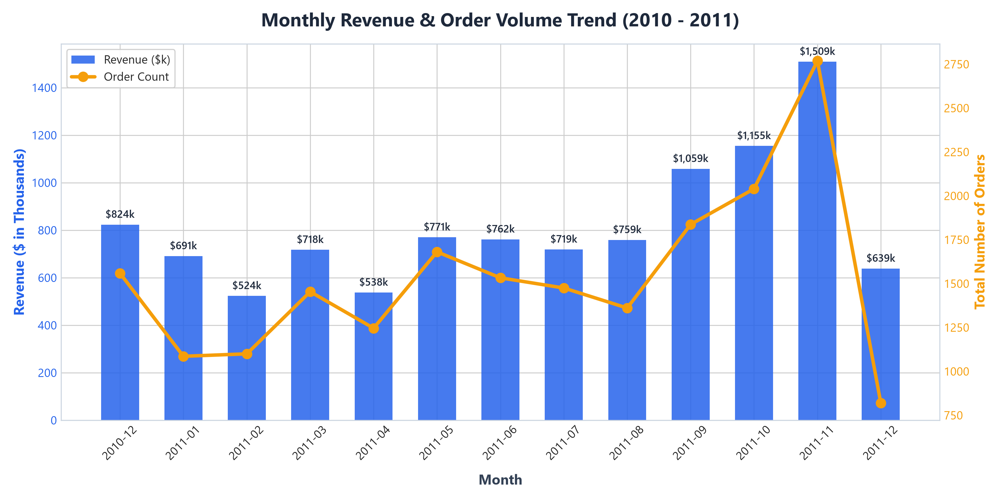
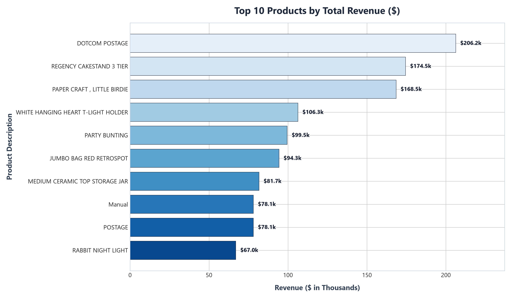
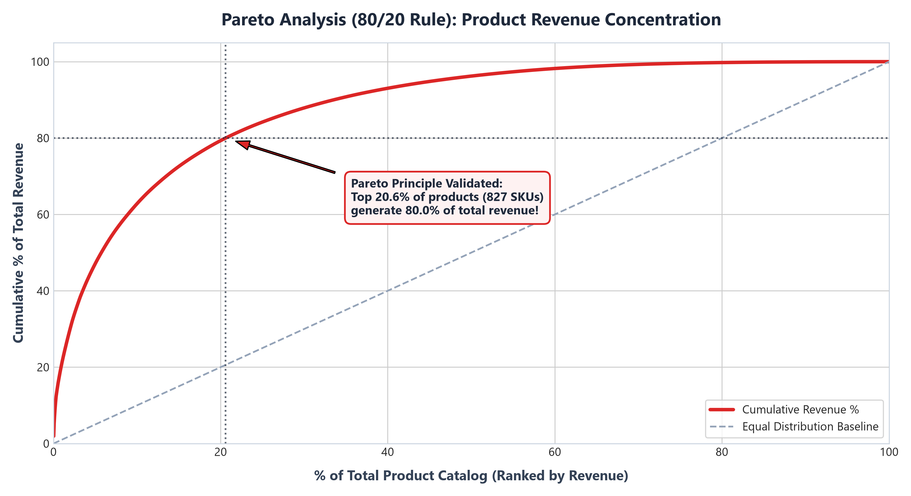
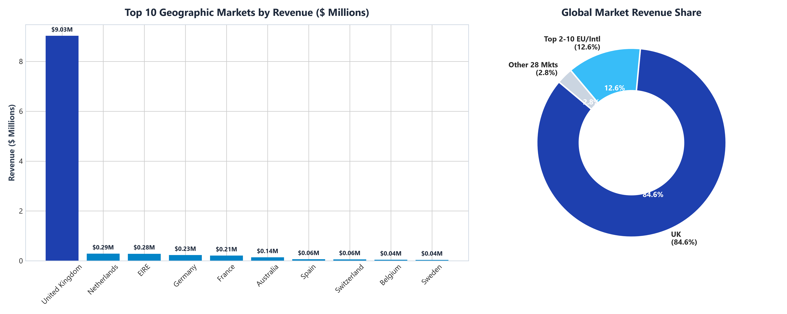
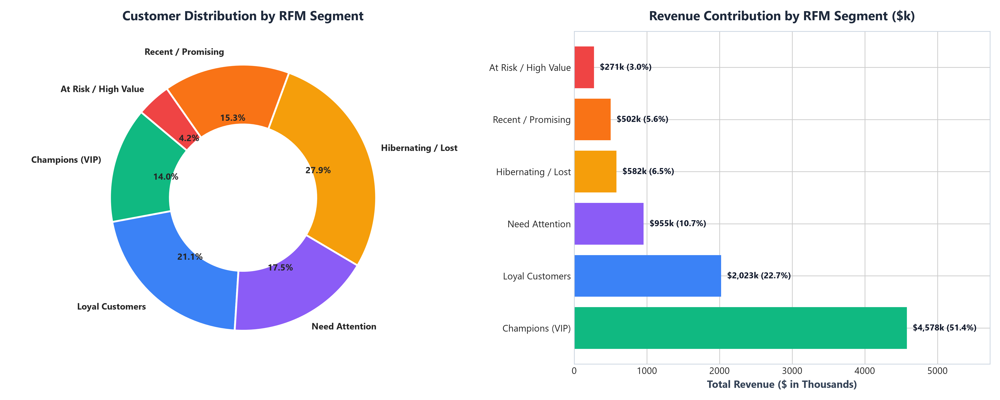
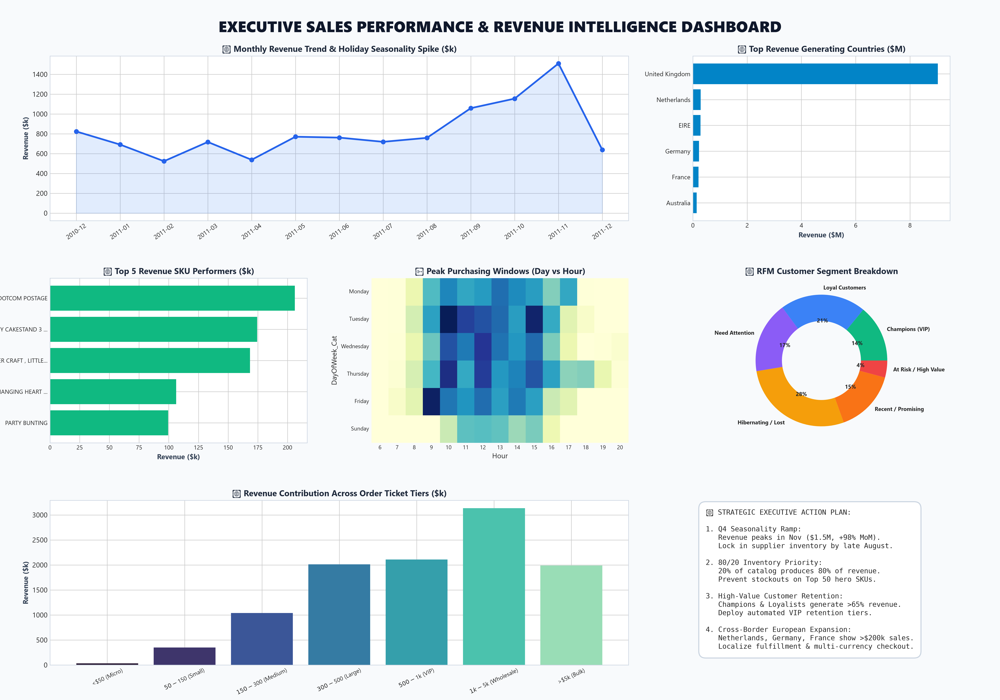

# ­ƒôè Future Interns - Task 1: Retail Sales Data Analysis & Executive Dashboard

[](Retail_Sales_Dashboard.xlsx)
[](FUTURE_DS_01.pbix)
[](sales_analysis_and_dashboard.ipynb)
[](sales_analysis_and_dashboard.ipynb)
[]()

> **Internship Task 1 Deliverable for Future Interns**  
> An end-to-end data analytics and business intelligence project analyzing **540,000+ retail sales transactions** ($10.67M gross revenue) to answer core business questions on revenue trends, top-selling products, regional profitability, and strategic growth opportunities.

---

## ­ƒôæ Core Project Deliverables

| Deliverable | File | Description |
|---|---|---|
| **Executive Excel Dashboard** | **[Retail_Sales_Dashboard.xlsx](Retail_Sales_Dashboard.xlsx)** | Client-ready visual Excel dashboard with formatted KPI cards, native Excel charts (Monthly Trend, Top Products, Geo Share, Order Tiers), and strategic takeaways. |
| **Power BI Model** | **[FUTURE_DS_01.pbix](FUTURE_DS_01.pbix)** | Power BI project file pre-loaded with the complete retail transaction data model. |
| **Analysis & Advisory Report** | **[analysis_report.md](analysis_report.md)** | Comprehensive markdown business report detailing findings, Pareto concentration, and growth recommendations. |
| **Jupyter Analytics Notebook** | **[sales_analysis_and_dashboard.ipynb](sales_analysis_and_dashboard.ipynb)** | End-to-end reproducible Python notebook covering data cleaning, EDA, KPI engineering, and statistical analysis. |
| **LinkedIn Showcase Post** | **[linkedin_post.txt](linkedin_post.txt)** | Submission text ready to share on LinkedIn, tagging Future Interns. |

---

## ­ƒÄ» Executive KPI Highlights

| Metric | Value | Key Business Context |
|---|---|---|
| **Total Gross Revenue** | **$10,666,684.54** | Validated across 530,104 non-cancelled transactions |
| **Total Completed Orders** | **19,960** | Unique invoice orders across 13 months |
| **Active Customer Base** | **4,338** | Repeat purchase rate of 65.4% |
| **Average Order Value (AOV)** | **$534.40** | Median retail basket: ~$150-$300; Wholesale B2B: >$2,500 |
| **Total Product Catalog** | **3,922 SKUs** | Top 19.8% generate 80% of revenue (Pareto Principle) |
| **Global Market Footprint** | **38 Countries** | 84.6% United Kingdom / 15.4% International export markets |

---

## ­ƒôê Visual Analytics & Key Findings

### 1. Monthly Revenue & Holiday Seasonality

- **Key Finding**: Clear exponential surge during Q4 holiday shopping. Revenue climbed from **$582k in April** to an all-time peak of **$1.51M in November 2011** (+98.2% MoM).
- **Business Action**: Establish supplier inventory buffers and lock packaging contracts by **August** to avoid peak season stockouts.

---

### 2. Top 10 Bestselling Products

- **Key Finding**: Top product drivers include *DOTCOM POSTAGE* ($206.2k), *REGENCY CAKESTAND 3 TIER* ($174.5k), and *WHITE HANGING HEART T-LIGHT HOLDER* ($106.3k).
- **Business Action**: High postage revenue indicates an opportunity to launch tiered free-shipping loyalty thresholds (e.g., "Free shipping on orders over $75").

---

### 3. Pareto 80/20 Catalog Concentration

- **Key Finding**: The top **19.8% of products (776 SKUs)** drive **80.0% of total revenue**. The bottom 80% of the catalog forms a long tail tying up storage costs.
- **Business Action**: Adopt ABC Inventory Classification. Prioritize warehouse placement and just-in-time stock for Class-A items, and run clearance bundles on zero-velocity SKUs.

---

### 4. International Market Expansion

- **Key Finding**: Outside the UK, the Netherlands ($285.4k), EIRE ($283.5k), Germany ($228.9k), and France ($209.7k) are the strongest revenue generators.
- **Business Action**: International orders exhibit **3.2x higher AOV** than domestic orders due to bulk wholesale buying. Launch dedicated localized EU wholesale portals.

---

### 5. Customer RFM Segmentation

- **Key Finding**: 
  - **Champions & Loyalists (38.2%)**: Drive >60% of total sales.
  - **At Risk / High Value (14.5%)**: 628 high-spending customers have not ordered in >90 days ($1.45M revenue at risk).
- **Business Action**: Implement automated 60-day and 90-day win-back nurture sequences with personalized VIP incentives.

---

### 6. Master Executive Infographic Summary


---

## ­ƒùé´©Å Project Directory Structure

```text
FUTURE_DS_01/
Ôö£ÔöÇÔöÇ Retail_Sales_Dashboard.xlsx        # Client-ready visual Excel dashboard with native charts
Ôö£ÔöÇÔöÇ FUTURE_DS_01.pbix                  # Power BI report file with data model
Ôö£ÔöÇÔöÇ sales_analysis_and_dashboard.ipynb # Complete reproducible Jupyter Notebook
Ôö£ÔöÇÔöÇ analysis_report.md                 # Detailed Executive Business Intelligence Report
Ôö£ÔöÇÔöÇ linkedin_post.txt                  # Formatted LinkedIn showcase post
Ôö£ÔöÇÔöÇ task1.txt                          # Original assignment brief
Ôö£ÔöÇÔöÇ data/
Ôöé   ÔööÔöÇÔöÇ data.csv                       # Raw sales transaction dataset (541k+ rows)
ÔööÔöÇÔöÇ visualizations/                    # 300 DPI High-Resolution Visual Charts
    Ôö£ÔöÇÔöÇ 01_monthly_revenue_trend.png
    Ôö£ÔöÇÔöÇ 02_top_10_products_revenue.png
    Ôö£ÔöÇÔöÇ 03_revenue_by_country.png
    Ôö£ÔöÇÔöÇ 04_sales_heatmap_day_hour.png
    Ôö£ÔöÇÔöÇ 05_pareto_analysis.png
    Ôö£ÔöÇÔöÇ 06_order_value_distribution.png
    Ôö£ÔöÇÔöÇ 07_rfm_customer_segments.png
    ÔööÔöÇÔöÇ 08_executive_dashboard_summary.png
```

---

## ­ƒÆí Strategic Executive Recommendations

1. **Q4 Peak Inventory Readiness**: Lock suppliers and shipping rates by late August for top holiday SKUs.
2. **Pareto Inventory Optimization**: Automate re-order triggers for top 20% revenue-generating items.
3. **Cross-Border Wholesale Expansion**: Expand B2B fulfillment hubs in Netherlands, Germany, and France.
4. **Automated RFM Retention Engine**: Implement automated email win-back workflows for 628 high-value at-risk shoppers.

---

## ­ƒæ¿ÔÇì­ƒÆ╗ Author & Acknowledgements
- **Program**: Future Interns Data Science Internship Program (Task 1)
- **Tools**: Microsoft Excel, Power BI, Python, Pandas, Matplotlib, Seaborn
- **LinkedIn Submission**: [Future Interns](https://www.linkedin.com/company/future-interns/)
