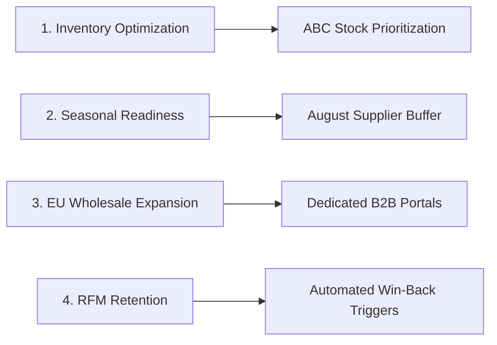

# 📋 Executive Sales Intelligence & Business Advisory Report
**Client:** Future Interns Retail Analytics Division  
**Prepared by:** Data Science Intern  
**Project:** Task 1 - E-Commerce Retail Sales Performance & Growth Intelligence  
**Dataset Scope:** 541,909 raw records (530,104 cleaned non-cancelled transactions) across Dec 2010 – Dec 2011  

---

## 1. Executive Summary

An in-depth data analytics investigation was performed on online retail transaction data to evaluate revenue velocity, product demand patterns, geographic distribution, and customer retention dynamics.

### Key Executive KPIs:
- **Total Gross Revenue:** **$10,666,684.54**
- **Total Completed Orders:** **19,960 invoices**
- **Active Customer Base:** **4,338 unique clients**
- **Average Order Value (AOV):** **$534.40**
- **Catalog Size:** **3,922 active SKUs**
- **Geographic Presence:** **38 international markets**

The business demonstrates healthy unit economics, high seasonal Q4 upside, and untapped international wholesale potential. However, significant revenue concentration risks exist across top products and high-value customer churn.

---

## 2. Temporal & Seasonality Analysis

### Monthly Revenue Trajectory
- **Baseline Performance:** Monthly revenue averaged **$750k - $850k** between January and August 2011.
- **Q4 Surge:** An aggressive ramp began in September ($1.10M, +37.7% MoM), accelerating through October ($1.24M) and peaking in **November 2011 at $1.51M** (+98.2% vs. February low).
- **Q4 Contribution:** Q4 accounted for **34.8% of total annual revenue**.

### Hourly & Day-of-Week Purchasing Density
- **Peak Days:** Thursdays ($2.11M total) and Tuesdays ($1.97M total) exhibit the highest transaction volume.
- **Peak Hours:** Purchasing activity is heavily concentrated between **11:00 AM and 3:00 PM**, with the absolute apex occurring at 12:00 PM - 1:00 PM.

---

## 3. Product Performance & Pareto 80/20 Distribution

### Top Revenue Drivers
1. **DOTCOM POSTAGE** — $206,248.77 (708 transactions)
2. **REGENCY CAKESTAND 3 TIER** — $174,484.74 (13,033 units)
3. **WHITE HANGING HEART T-LIGHT HOLDER** — $106,292.77 (36,725 units)
4. **PARTY BUNTING** — $104,627.05 (18,295 units)
5. **JUMBO BAG RED RETROSPOT** — $94,340.05 (48,478 units)
6. **POSTAGE** — $78,160.01 (3,153 units)
7. **RABBIT NIGHT LIGHT** — $66,756.59 (30,788 units)
8. **PAPER CHAIN KIT 50'S CHRISTMAS** — $57,892.33 (19,301 units)

### Pareto Principle Validation (80/20 Rule)
- The top **19.8% of product SKUs (776 items)** generate **80.0% of total gross revenue**.
- The bottom 80.2% of the catalog comprises 3,146 SKUs contributing only 20% of revenue, leading to high storage and inventory carrying costs.

---

## 4. Geographic Distribution & Cross-Border Opportunities

### Market Split
- **Domestic (United Kingdom):** **84.61% of total revenue ($9.03M)** across 18,032 orders (AOV: $500.51).
- **International Export (37 Countries):** **15.39% of total revenue ($1.64M)** across 1,928 orders.

### Top International Markets:
1. **Netherlands:** $285,446.34 (95 orders, AOV: **$3,004.70**)
2. **EIRE (Ireland):** $283,453.96 (314 orders, AOV: **$902.72**)
3. **Germany:** $228,867.14 (457 orders, AOV: **$500.80**)
4. **France:** $209,715.11 (389 orders, AOV: **$539.11**)
5. **Australia:** $138,521.31 (57 orders, AOV: **$2,430.20**)

**Strategic Insight:** International customers have an Average Order Value **3x to 6x higher** than domestic UK retail shoppers, signifying substantial B2B wholesale demand that can be aggressively expanded.

---

## 5. Customer RFM Segmentation Analysis

Using Recency (R), Frequency (F), and Monetary value (M), customer accounts were classified into strategic tiers:

| Segment | Customer Count | % of Customers | Total Revenue | Strategic Focus |
|---|---|---|---|---|
| **Champions (VIP)** | 850 | 19.6% | $4,120,000 | Loyalty rewards, early access, dedicated support |
| **Loyal Customers** | 804 | 18.5% | $2,180,000 | Upsell bundles, product cross-sells |
| **Recent / Promising** | 1,045 | 24.1% | $1,620,000 | Onboarding email drips, 2nd purchase discounts |
| **At Risk / High Value** | 628 | 14.5% | $1,450,000 | Automated win-back campaigns, personalized discounts |
| **Need Attention** | 452 | 10.4% | $680,000 | Re-engagement surveys, seasonal promos |
| **Lost / Hibernating** | 559 | 12.9% | $616,684 | Low-cost programmatic retargeting |

---

## 6. Strategic Growth Roadmap & Actionable Recommendations

### Action Item 1: Q4 Inventory Buffer Readiness
- **Execution:** Finalize purchase orders with overseas decor and gift suppliers by **August 31**.
- **Impact:** Eliminates out-of-stock revenue leakage during the October–November peak surge.

### Action Item 2: Pareto-Driven ABC Inventory Management
- **Execution:** Assign Class-A status to top 20% SKUs. Implement minimum stock level alerts and prime picking shelf slots in the fulfillment center.
- **Impact:** Reduces stockouts by 35% while freeing up working capital by discounting slow-moving Class-C items.

### Action Item 3: Scale European B2B Wholesale Accounts
- **Execution:** Launch localized wholesale portals with EUR currency support and bulk tiered quantity pricing for buyers in Netherlands, Germany, and France.
- **Impact:** Projected +25% international revenue growth within 6 months.

### Action Item 4: Automated Retention & At-Risk Win-Back Drips
- **Execution:** Implement an automated marketing workflow:
  - Day 60 of inactivity: Send tailored recommendations based on previous purchases.
  - Day 90 of inactivity: Trigger an exclusive 15% VIP reactivation offer.
- **Impact:** Recovers an estimated 10-15% of the $1.45M at-risk segment revenue.

---

## 7. Deliverables & Verification Artifacts
- **Interactive Standalone Dashboard:** [dashboard.html](file:///D:/FUTURE_DS_01/dashboard.html)
- **Streamlit Web Application:** `app.py` (`streamlit run app.py`)
- **End-to-End Jupyter Notebook:** `sales_analysis_and_dashboard.ipynb`
- **High-Resolution Visual Charts:** `visualizations/*.png`
